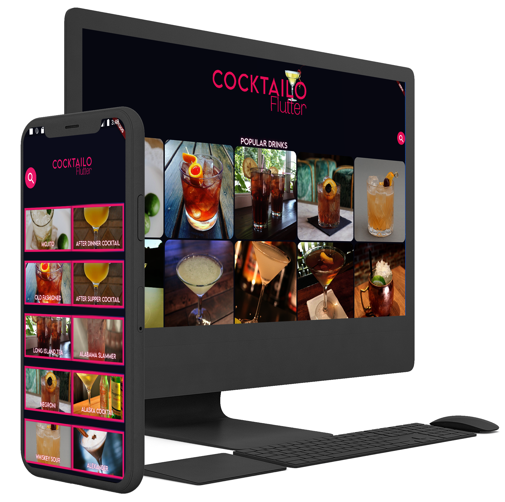

# Cocktailo

 

## Getting Started

This app is all about cocktails and is made in Flutter ! Get detailed info about ingredients and step by step descriptions. The information is fetched from the <a href="https://rapidapi.com/thecocktaildb/api/the-cocktail-db">"The Cocktail DB"</a> API.

> This is a fun and laidback project, and obviously not finished.

### Screenshots

#### Mobile

Loading Screen |Landing Page| To Cocktail |  Search |
------------ |------------ | -------------|-------------|
 |  ||

#### Desktop

