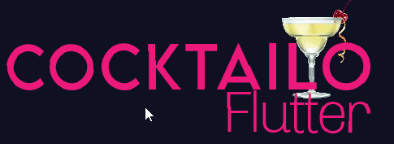

# Cocktailo

<a href="https://play.google.com/store/apps/details?id=gr.esentis.blue_waves_flutter"></a>

[](https://forthebadge.com)

[](https://forthebadge.com)

## Getting Started

This app is all about cocktails and is made in Flutter ! Get detailed info about ingredients and step by step descriptions. The information is fetched from the <a href="https://rapidapi.com/thecocktaildb/api/the-cocktail-db">"The Cocktail DB"</a> API.

## Screenshots

```Coming soon...```
